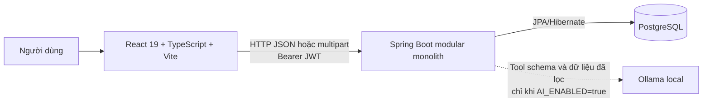
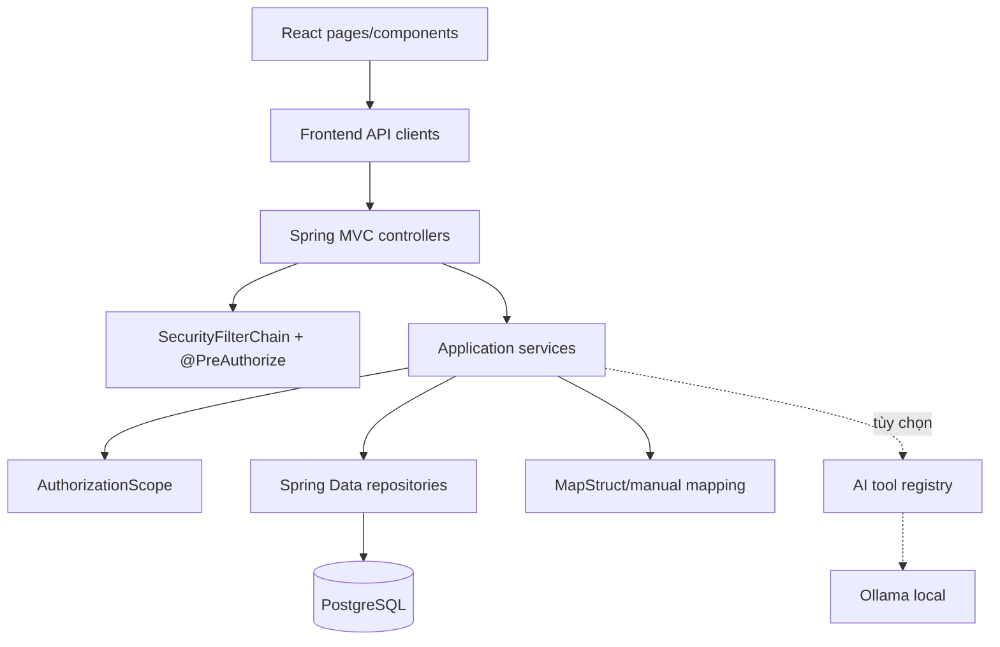
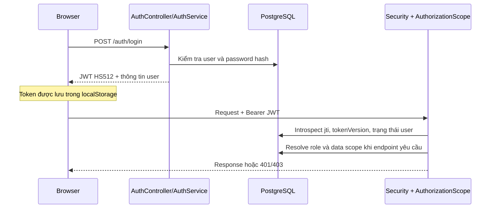
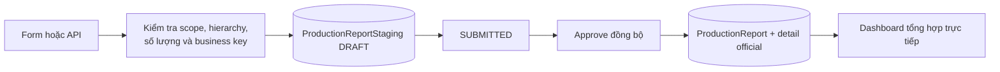
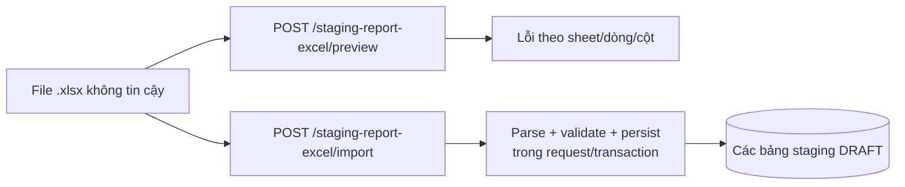
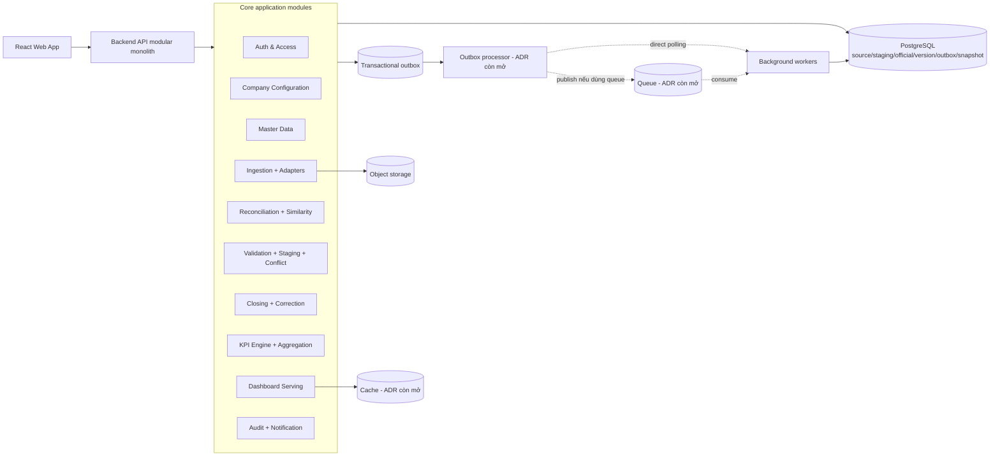

# Kiến trúc hệ thống FactoryManager

> Trạng thái tài liệu: mô tả kiến trúc hiện tại của repository và kiến trúc mục
> tiêu theo PRD v2.5/TDD v1.5. “Target” không có nghĩa là đã được triển khai.

## 1. Phạm vi và nguồn sự thật

Tài liệu này dùng bốn lớp nguồn theo thứ tự sau:

1. Source code và cấu hình trong repository là nguồn sự thật cho hành vi
   **Current**.
2. [PRD v2.5](PRD_He_thong_hieu_suat_nha_may.md) là nguồn sự thật cho nhu
   cầu, phạm vi, vai trò và quy tắc nghiệp vụ **Target**.
3. [TDD v1.5](TDD_He_thong_hieu_suat_nha_may.md) là nguồn sự thật cho kiến
   trúc kỹ thuật **Target**.
4. [DECISIONS.md](DECISIONS.md) ghi những quyết định đã chốt, quyết định đang
   được code hiện thực hóa nhưng chưa có ADR chính thức, và các blocker còn mở.

Khi code khác PRD/TDD, tài liệu phải nêu cả hai phía. Không suy diễn rằng một
endpoint, bảng hoặc worker trong TDD đã tồn tại nếu source code chưa có.

## 2. Current — hệ thống đang có trong repository

### 2.1. Topology triển khai hiện tại



Các thành phần có bằng chứng trực tiếp:

| Thành phần | Hiện trạng |
|---|---|
| Frontend | React 19, TypeScript, Vite và React Router trong [`factory-management-frontend`](factory-management-frontend/) |
| Backend | Java 17, Spring Boot 4.1, Spring MVC, Validation, Security, OAuth2 Resource Server trong [`pom.xml`](factory-management/pom.xml) |
| Persistence | Spring Data JPA/Hibernate và PostgreSQL |
| API base URL mặc định | `http://localhost:8080/factory-management/api/v1` |
| Authentication | JWT HS512 stateless, access token/refresh/logout/introspection và token revocation trong PostgreSQL |
| File import đang hoạt động | Excel `.xlsx` được parse đồng bộ bằng Apache POI; tối đa 10 MB và 10.000 dòng |
| AI tùy chọn | Ollama local qua các tool backend đã whitelist và kiểm tra scope |
| Chưa có trong runtime | Redis/cache, message queue, object storage, outbox processor, KPI aggregation worker |

Backend đang tổ chức theo các package kỹ thuật `controller`, `service`,
`repository`, `entity`, `dto`, `mapper`, `security`. Đây là một monolith phân
lớp; ranh giới module nghiệp vụ chưa được đóng gói thành module Java độc lập.

### 2.2. Dependency graph hiện tại



Quy tắc dependency thực tế:

- Frontend chỉ gọi HTTP API; không truy cập database.
- Controller nhận DTO, gọi service và trả `ApiResponse<T>`.
- Service chứa phần lớn validation, state transition, transaction và KPI hiện
  tại.
- Repository/JPA entity là lớp persistence. Một số service phụ thuộc trực tiếp
  nhiều repository, nên domain rule và hạ tầng chưa tách thành port/adapter.
- `AuthorizationScope` truy vấn quan hệ
  `User → Employee → Team → ProductionLine → Department → Factory` và
  `UserDataScope` để kiểm tra quyền theo bản ghi.

### 2.3. Module hiện có

| Nhóm | Thành phần hiện có |
|---|---|
| Identity và access | Auth, user/role, token version, invalid token, data scope, audit |
| Master data | Factory, department, production line, team, employee, shift, machine type, machine, downtime reason, quality error type, product, material |
| Production planning | Production plan và production order |
| Production staging | Production report, downtime, quality, material issue và employee actual staging |
| Official production | `ProductionReport` cùng các bảng detail official được copy khi approve |
| Import | Template, preview và import Excel vào staging trong một request đồng bộ |
| Dashboard | Production dashboard theo scope và executive dashboard truy vấn dữ liệu hiện hành |
| Ngoài lõi Must hoặc capability mở rộng | Chấm công/lương/KPI cá nhân, finance, warehouse đầy đủ, maintenance đầy đủ và AI chatbot có kiểm soát |

PRD chỉ đưa nhân sự/vật tư ở phạm vi vận hành vào lõi; chấm công/lương/KPI cá nhân,
kho đầy đủ, bảo trì đầy đủ, tài chính và chatbot tự do nằm ngoài Must. Các module đã tồn tại vẫn là hiện trạng cần bảo trì, nhưng không được
dùng để kết luận rằng các yêu cầu target về closure, correction, KPI snapshot
hoặc source traceability đã hoàn thành.

### 2.4. Data flow hiện tại

#### Đăng nhập và kiểm tra quyền



Role hiện có là `ADMIN`, `DIRECTOR`, `FACTORY_MANAGER`,
`DEPARTMENT_MANAGER`, `FINANCE`, `PRODUCTION_MANAGER`, `TEAM_LEADER` và
`EMPLOYEE`. Đây chưa khớp ba cấp vận hành target. Migration phải map có chủ đích
sang `EXECUTIVE_MANAGER`, `OPERATIONS_MANAGER`, `OPERATIONS_STAFF`, tách
Ca trưởng/Tổ trưởng thành employee position và giữ functional roles riêng; không đổi enum hàng loạt rồi mặc định giữ nguyên quyền.

#### Nhập tay, duyệt và tạo dữ liệu official



Các đặc điểm cần hiểu đúng:

- Business key staging hiện là
  `reportDate + shiftId + teamId + machineId`; chưa có `companyId` hoặc
  `productId`.
- Approve tạo `ProductionReport` và copy downtime/quality/material/employee
  detail trong transaction đồng bộ.
- KPI availability/performance/quality/OEE được tính bằng code cố định khi tạo
  official report.
- Official record hiện liên kết một-một với staging nguồn nhưng chưa có
  official version history, reopen request hoặc correction workspace.
- Dashboard production hiện đọc và tổng hợp trực tiếp `ProductionReport`;
  chưa đọc `kpi_snapshots` hoặc cache.

#### Import Excel



Flow này chưa phải source-batch pipeline của TDD:

- file được xử lý đồng bộ;
- nếu inspection có bất kỳ lỗi nào, Current không persist dòng nào; chưa hỗ trợ
  “dòng hợp lệ thành công, dòng lỗi bị giữ lại”;
- không lưu original file vào object storage;
- không tạo outbox event hoặc background job;
- không có resource source batch để polling;
- route này không tự submit, approve hoặc tạo official data.

Repository có entity/service rời rạc cho `DailyCloseBatch`,
`ReportImportBatch`, generated file và import official, nhưng chưa có controller
public cho closure/source-batch workflow. Chúng là code nền/dormant, không phải
API đang tồn tại.

#### Dashboard và AI

- `production-reports/dashboard` và `dashboard/my-scope` tổng hợp dữ liệu
  official trực tiếp trong service.
- `ReportsPage` gọi `GET /production-reports/search/my-scope`, nhưng backend
  chỉ có `/production-reports/search` và `/dashboard/my-scope`; vì vậy trang
  Reports theo scope hiện lỗi contract và không phải luồng demo dùng được.
- `RoleOverviewPage` không render `summary.error`, còn formatter đổi giá trị
  thiếu thành `0`; lỗi mạng/backend có thể bị trình bày sai như KPI bằng không.
- `executive-dashboard` tổng hợp production, finance và maintenance theo kỳ.
- AI chatbot chỉ chọn tool backend đã whitelist. Tool tiếp tục gọi
  `AuthorizationScope`; Ollama không nhận DB credential hoặc chạy SQL tự do.

### 2.5. Trust boundaries hiện tại

| Boundary | Dữ liệu đi qua | Kiểm soát hiện có | Rủi ro/gap |
|---|---|---|---|
| Browser → API | JWT, JSON, file Excel | JWT, Bean Validation, `@PreAuthorize`, scope lookup, file size/row limits | JWT được lưu `localStorage`; chưa có CSP/XSS hardening được mô tả |
| Client-supplied IDs → domain | factory/department/line/team/machine IDs | Backend tải entity và kiểm tra hierarchy/scope | Chưa có `companyId`; không được xem ID client là bằng chứng quyền |
| API → PostgreSQL | Entity và query | JPA parameter binding, transaction | `ddl-auto=update` và `schema.sql` chạy khi startup chưa phải migration production an toàn |
| API → Ollama | Tool schema và aggregate đã lọc | Feature flag, role/scope, allowlist, rate limit in-memory | Khi scale nhiều instance cần shared rate limit; endpoint/model phải được coi là external boundary |
| File upload → parser | Multipart `.xlsx` | 10 MB, 10.000 dòng, parse/validation trước persist | Chưa có malware scanning, object quarantine hoặc source retention |
| Runtime config | DB/JWT/admin bootstrap secrets | Có `.env.example` | `application.yaml` còn development defaults cho JWT/admin; không được dùng nguyên trạng ở production |

## 3. Target — kiến trúc theo PRD v2.5/TDD v1.5

### 3.1. Mục tiêu topology



MVP target vẫn là một deployment single-tenant cho một công ty. Schema và
configuration có `companyId`, nhưng database isolation cho nhiều tenant không
thuộc MVP.

Redis, queue và object storage trong sơ đồ là thành phần target; công nghệ và
cách triển khai cụ thể vẫn phải qua ADR, không phải dependency hiện có.

### 3.2. Ranh giới module target

| Module | Sở hữu | Không được vượt ranh giới |
|---|---|---|
| Auth & Access | Identity, authentication, role/action/data scope, company context | Không tin role/scope/company từ client |
| Company Configuration | Timezone, production day, calendar, shifts, terminology, validation/KPI/notification policy | Không chứa dữ liệu vận hành phát sinh |
| Master Data | Factory/line/work group/machine/product/standard/reason cùng effective dates | Không hard delete dữ liệu đã được tham chiếu |
| Ingestion/Adapters | Manual/file/API/OCR source, mapping version, original file, source batch | Không ghi thẳng official data |
| Reconciliation/Similarity | Time classification, business data code, exact/candidate matching, Excel–web–OCR comparison | Không tự merge hoặc chọn precedence từ AI score |
| Validation/Staging | Canonical staging, Error/Warning/Information, dedup và conflict group | Không tính KPI official |
| Closing/Correction | Coverage, warning override, partial close, reopen approval, correction workspace, official versions | Không aggregation nặng trong closure transaction |
| KPI/Aggregation | KPI Dictionary versioned, snapshot, completeness, contributor links | Không hardcode formula trong controller |
| Dashboard Serving | Filter, comparison, freshness, coverage, drill-down | Không quét raw data cho overview; không vượt scope |
| Audit/Notification | Append-only audit, import/closure/job notification | Không chứa secret hoặc dữ liệu nhạy cảm không cần thiết |
| Navigation/Capability | Stable module key/label, release enablement và presentation access | Không thay server authorization bằng việc ẩn tab |

Target nên giữ dependency hướng vào trong:

```text
HTTP/worker adapter → application use case → domain policy
                                      ↑
                    repository/queue/storage adapter implements port
```

Domain rule về closure, identity, effective dating và KPI không phụ thuộc trực
tiếp Spring MVC, JPA, Redis hoặc SDK object storage.

### 3.3. Data flow target

#### Manual ingestion

```text
Authenticated request
→ server resolve company + permitted scope
→ create source/provenance metadata for manual input
→ normalize to canonical record
→ derive dataTimeClass/businessDataCode
→ exact dedup + candidate matching + validation/conflict
→ staging
→ audit in the same transaction
```

#### File ingestion

```text
untrusted upload
→ temporary/quarantined object
→ transaction: source_batch + file key + import_requested outbox
→ commit
→ outbox processor/job with idempotency
→ versioned adapter mapping
→ source records + row errors + time classification + match candidates
→ Excel–web reconciliation; attach OCR only as optional secondary evidence
→ staging/conflicts
→ notification
```

Worker phải đọc theo committed `sourceBatchId/fileKey`, retry lỗi tạm thời và
không tạo staging trùng khi event/job được giao lại.

Similarity chạy sau exact identity và trên candidate set đã giới hạn. Baseline `0.90 <= score < 1.00`
chỉ tạo warning có explanation/model-policy version. Cùng identity nhưng khác giá trị luôn thành
conflict. OCR không được gọi Closing/Official repository và không được gửi dữ liệu nhạy cảm ra model ngoài nếu chưa có quyết định bảo mật riêng.

#### Closure và correction

```text
close request
→ resolve scope + acquire deterministic hierarchical lock
→ recheck coverage/Error/Warning/conflict in transaction
→ official version + closure + audit + kpi outbox
→ commit
→ aggregation marks/rebuilds direct and ancestor snapshots

reopen request
→ một bước duyệt mở lại bởi Quản lý điều hành (quyết định PRD)
→ isolated correction workspace
→ keep last official version serving with “under correction”
→ reclose creates a new official version
→ previous version becomes superseded
→ affected snapshots become stale and are rebuilt bottom-up
```

Chi tiết coverage, production-day rule, logical identities, validation
threshold và late-data window còn là domain blocker trong
[DECISIONS.md](DECISIONS.md).

#### Dashboard read path

```text
request + filters
→ server resolve company/operational role/functional action/scope
→ KPI snapshot/cache for overview
→ return completeness + coverage + lastUpdated/dataFreshness
→ contributor links for drill-down
→ official version
→ source metadata and authorized audit summary
```

`GET /dashboard/charts` đọc chart catalog whitelist và trả tối thiểu tám view cốt lõi theo cùng
filter/completeness/freshness contract. Chart vật tư, kho và bảo trì trả `unavailable_capability`
khi module chưa bật; không tạo series giả hoặc biến empty/error thành zero.

Overview target p95 dưới 3 giây; drill-down p95 dưới 5 giây. Sau close/reclose,
KPI phải cập nhật trong 5 phút hoặc trả trạng thái đang cập nhật.

### 3.4. Trust boundaries target

- Browser, file, query filter và mọi ID do client gửi đều không đáng tin.
- Backend tự resolve `companyId` và effective data scope; mọi query target phải
  có tenant/scope predicate hoặc một authorization guard tương đương.
- Queue delivery là at-least-once theo giả định an toàn; mọi write job có
  idempotency key và unique constraint/persistence tương ứng.
- Outbox event được ghi cùng transaction nghiệp vụ. Việc publish queue không
  được nằm trong transaction closure.
- Original file được cách ly khỏi public web root; access đi qua authorization
  và retention policy.
- Secret chỉ đến từ environment/secret manager. Không dùng default development
  cho production.
- Ollama/OCR/ERP/MES là external adapter. Chúng không được nhận DB credential,
  tự quyết source precedence hoặc bỏ qua access control.

## 4. Khoảng cách Current → Target

| Năng lực | Current | Target |
|---|---|---|
| Tenant context | Không có `Company`/`companyId` | Single-tenant runtime nhưng mọi dữ liệu/config có `companyId` |
| Organization history | Quan hệ hiện tại + `active`; phần lớn không effective-dated | Effective-dated hierarchy, machine assignment, standards, shifts và scope |
| Product identity | Production staging key chưa có product | Canonical production identity có product theo quyết định TBD-07 |
| Source provenance | One-to-one official → staging; Excel không có source batch lâu dài | Source batch/record/file/adapter version và contributor trace |
| Role/navigation | Tám enum role và menu theo role; TEAM_LEADER là security role | Ba cấp vận hành + functional roles; Ca trưởng/Tổ trưởng là position; module catalog theo PRD 4.4 |
| Historical data | Chỉ có report date; không time class/business data code | Current/Historical Backfill/Late Arrival/Correction và businessDataCode versioned |
| Similarity/reconciliation | Không có candidate score hoặc Excel–web–OCR run/item | Exact-first matching, warning từ 90% đến dưới 100%, human resolution và OCR secondary evidence |
| Validation | Validation viết trong service/import | Versioned rules Error/Warning/Information và warning override |
| Conflict | Unique constraint hoặc reject | Conflict group, field comparison và authorized resolution |
| Closure | Approve từng staging tạo official ngay; close artifacts chưa exposed | Close theo date/scope, partial coverage, lock hierarchy |
| Correction | Chưa có reopen/version history | Reopen one-step, workspace, reclose và superseded versions |
| KPI | Công thức OEE hardcode khi approve | KPI Dictionary/version/effective date/aggregation rule |
| Dashboard | Aggregate trực tiếp official rows; Reports route lệch contract và overview có thể đổi error/missing thành 0 | Snapshot/cache, chart catalog, completeness, coverage, freshness, contributor links |
| Async/reliability | Import và official creation đồng bộ | Outbox, workers, retry/backoff, idempotency và reconciliation |
| Storage | File xử lý trong request; một flow lưu blob trong DB nhưng chưa exposed | Object storage + lifecycle/retention |
| API | Domain-specific current routes và `{code,result}` envelope | Canonical target routes; envelope migration còn phải chốt |
| Operations | Không có queue/cache metrics hoặc deployment topology | Structured logs, metrics, alerts, backup/restore, RPO/RTO và performance profile |
| Tests | Một context-load test | Unit/integration/adapter contract/performance/E2E/security/concurrency |

## 5. Quy tắc thay đổi kiến trúc

Dùng ExecPlan theo [PLANS.md](PLANS.md) khi thay đổi kéo dài nhiều mốc và cần
sequencing, migration/backfill, benchmark hoặc rollback phức tạp. Việc đụng
API, identity, auth, queue hay KPI là tín hiệu phải đánh giá rủi ro, không tự
động biến mọi chỉnh sửa cục bộ thành một plan riêng.

Không triển khai phần phụ thuộc domain blocker trước khi quyết định hoặc một
giả định tạm thời có phạm vi/ngày hết hạn được ghi trong
[DECISIONS.md](DECISIONS.md) hay PRD.
